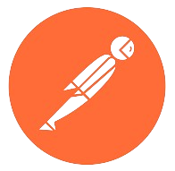
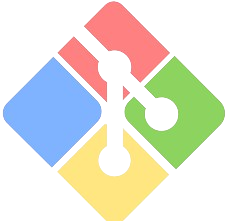

<h1 align="center">Hi 👋 There!   I'm Robin</h1>
<h3 align="center">
A passionate junior web developer with a huge love for JavaScript, TypeScript, CSS, Tailwind CSS, React, Node.js, Express.js, MongoDB</h3>
 

## :chart_with_upwards_trend: Current Stats

 

  

## :mailbox: Reach me out

 

[
](https://www.facebook.com/robinhossen636)[ 
](https://twitter.com/robinhossen636)

 

<!-- ## :computer: Technologies that I know

 

  -->

## 💻 Technologies & Tools

### Frontend Development

  
  
  
  
  
  
  
  

### ⚙️ Backend Development

  
  

### 📂 Database

  

## 🔧 Tools & Platforms

  
  
  

## :eyes: Current overview

<!-- ### 🔭 I’m working - In Programming Hero. -->

### 🌱 I’m exploring - Next.js, Redux, Express and Mongoose.

### 👯 I’m looking - For a job based on my skills.

### 🤔 I’m trying - To help people learn web development.

### ⚡ Fun fact - I love to teach & help people.

 
